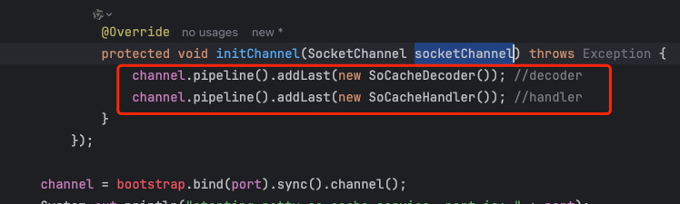
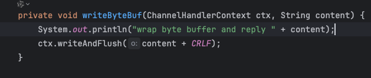
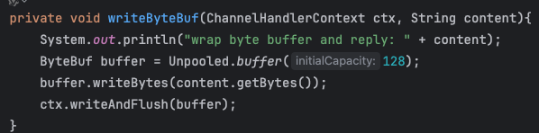
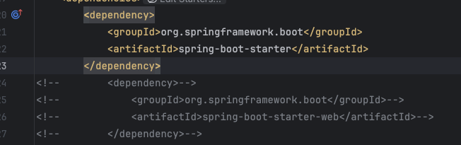

### 整体设计思路


### redis resp

**简介**

redis resp协议是redis的序列化协议，用于redis server和client之间的通信

**协议格式**
- 使用 * 表示数组开始
- 使用 $ 表示字符串开始

**协议示例**
1. SET key value (Simple Strings)
```shell
*3\r\nSET\r\n$3\r\nkey\r\n$5\r\nvalue\r\n
```
- *3 表示接下来有3个元素（命令名"SET"，键名"key"，值"value"）。
- $3, $3, $5 分别表示接下来的字符串参数的字节长度。
- \r\n 用于分隔协议中的各个部分。

2. 错误（Errors）: 以 - 开头，后跟错误描述，最后是 \r\n。例如：
```shell
-ERR unknown command 'UNKNOWNCMD'\r\n
```

3. 整数（Integers） 以 : 开头，后跟整数值，最后是 \r\n。例如，INCR 命令的响应：
```shell
:1\r\n
```        

4. 批量字符串（Bulk Strings））: 以 $ 开头，后跟字符串的字节数，再是 \r\n 和实际的字符串内容，最后是 \r\n。如果字符串为空或不存在，则长度为 -1。例如，获取键的值：
```shell
$5\r\nvalue\r\n
```

5. 数组（Arrays）: 以 * 开头，后跟数组内元素数量，其余部分根据元素类型重复上述格式。这常用于返回多个值，如 MGET 命令的响应：
```shell
*2\r\n$5\r\nvalue1\r\n$6\r\nvalue2\r\n
```

### 版本迭代计划

**v1.0 处理`redis-cli`输入输出** 
- 搭建netty server，监听6379端口，获取redis-cli输入,内部处理输入输出

### RESP 输入测试
- COMMAND
- PING
- INFO
- SET
- GET
- STRLEN
- DEL
- EXISTS
- MGET
- MSET
- INCR
- DECR

### 问题记录
1. 在配置SoCacheServer时，配置pipeline时需要注意channel的类型为SocketChannel，而不是Channel

2. NettyServer需要满足输入输出都是字节流，内部处理是字符流，所以需要注意encode和decode


3. pom文件不需要引入`spring-boot-starter-web`, 引入spring-boot-starter，避免启动tomcat server

